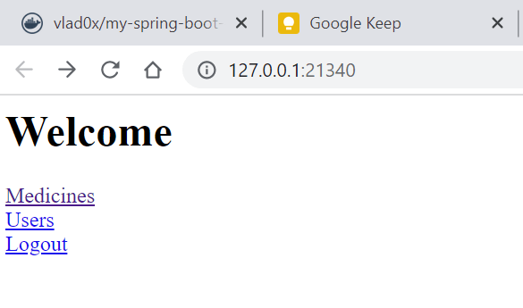
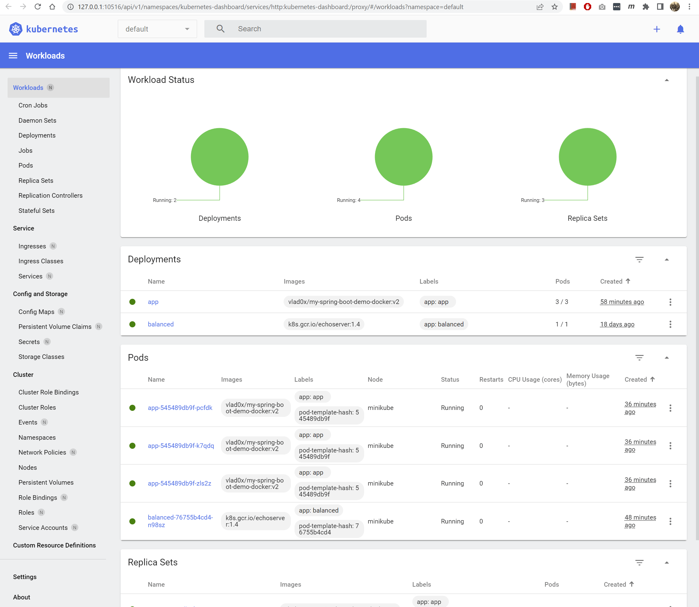

# Minikube Labs

According to the official page, [minikube][1] is local Kubernetes, focusing on making it easy to learn and develop for Kubernetes.

All you need is [Docker][9] (or similarly compatible) [container][3] or a [Virtual Machine][4] environment, and Kubernetes is a single command away: minikube start.

Per this lab, we'll use Docker, a few commands can be found [here][5]

It is meant to build one cluster, if you are into certifications, Kubernetes various options that can be found in the below link

[https://www.cncf.io/][6]

[CKA][7]

Once we have a Docker image, we want to run it in a cluster, we have a couple of options, but we can start with the minimal unit, the pods, i.e one pod for API, one for Frontend, etc.

Based on the images created like in this [link][8], we can create a pod out of our Docker images, like this:

```powershell
> kubectl run --image my-spring-boot-demo-docker:latest app
```

We'll have a result like this, where the pod/app is the name of the pod
pod/app created

We can check the pods with, if we add the option -w the command will wait for the pod to be terminated, like -f option from the Linux tail command:

kubectl get pods

This will return the names and the statuses of the applications that we are running

If we need to delete a pod we can execute the below command:

```powershell
> kubectl delete pod <name of the pod>
```


## Deployments

Lets start using Deployments and replicas with our Spring Boot application, that you can find in [this link](https://github.com/vladcuevas/spring-boot-labas)

```powershell
> kubectl create deployment --image my-spring-boot-demo-docker:latest app
```

We can check the deployments with:

```powershell
kubectl get deployments
```

We can also specify the option -l to filter by label.

You might also want to get the pods, and if you do so, there will be a pod with a random name. This is important in case that we want to scale, and for that we can create replicas like this:

```powershell
> kubectl scale --replicas=3 deployment/app
deployment.apps/app scaled
```

We can delete our deployments with:

```powershell
> kubectl delete deployment app
deployment.apps "app" deleted
```

Now, we'll start tagging with different names our container:

```powershell
> docker image tag my-spring-boot-demo-docker:latest vlad0x/my-spring-boot-demo-docker:v1
> docker image tag my-spring-boot-demo-docker:latest vlad0x/my-spring-boot-demo-docker:v2
> docker image push vlad0x/my-spring-boot-demo-docker:v1
The push refers to repository [docker.io/vlad0x/my-spring-boot-demo-docker]
8053c93da4dd: Layer already exists
d03e5d303c2e: Layer already exists
dc9fa3d8b576: Layer already exists
27ee19dc88f2: Layer already exists
c8dd97366670: Layer already exists
v1: digest: sha256:2f76b217a9090a6b692681ee33c9259ca84d25068cd1723baf55d9dbb73ee1d0 size: 1374
> docker image push vlad0x/my-spring-boot-demo-docker:v2
The push refers to repository [docker.io/vlad0x/my-spring-boot-demo-docker]
8053c93da4dd: Layer already exists
d03e5d303c2e: Layer already exists
dc9fa3d8b576: Layer already exists
27ee19dc88f2: Layer already exists
c8dd97366670: Layer already exists
v2: digest: sha256:2f76b217a9090a6b692681ee33c9259ca84d25068cd1723baf55d9dbb73ee1d0 size: 1374
```

In order for the Kubernetes to work, the Docker images must be in a public location, if we are working with copyrighted images, we must provide a secret.

We can create a deployment using any of our images, then we can describe our deployment and see the image that is using, which is the same image that is used for replicas.

```powershell
> kubectl create deployment app --image=vlad0x/my-spring-boot-demo-docker:v1
deployment.apps/app created
> kubectl get deployments
NAME       READY   UP-TO-DATE   AVAILABLE   AGE
app        1/1     1            1           9s
> kubectl describe deployment app
Name:                   app
Namespace:              default
CreationTimestamp:      Fri, 09 Sep 2022 19:37:38 -0500
Labels:                 app=app
Annotations:            deployment.kubernetes.io/revision: 1
Selector:               app=app
Replicas:               1 desired | 1 updated | 1 total | 1 available | 0 unavailable
StrategyType:           RollingUpdate
MinReadySeconds:        0
RollingUpdateStrategy:  25% max unavailable, 25% max surge
Pod Template:
  Labels:  app=app
  Containers:
   my-spring-boot-demo-docker:
    Image:        vlad0x/my-spring-boot-demo-docker:v1
    Port:         <none>
    Host Port:    <none>
    Environment:  <none>
    Mounts:       <none>
  Volumes:        <none>
Conditions:
  Type           Status  Reason
  ----           ------  ------
  Available      True    MinimumReplicasAvailable
  Progressing    True    NewReplicaSetAvailable
OldReplicaSets:  <none>
NewReplicaSet:   app-65d8f569c4 (1/1 replicas created)
Events:
  Type    Reason             Age   From                   Message
  ----    ------             ----  ----                   -------
  Normal  ScalingReplicaSet  21s   deployment-controller  Scaled up replica set app-65d8f569c4 to 1
```

If you run the get pods command you'll see that the pod was replicated with same name followed by other random characters:

```powershell
> kubectl get pods
NAME                        READY   STATUS    RESTARTS   AGE
app-65d8f569c4-4m6fj        1/1     Running   0          59s
app-65d8f569c4-hxn9j        1/1     Running   0          6m43s
app-65d8f569c4-kzrwg        1/1     Running   0          59s
```

The replicas will allow us to maintain high availability of the application, this is the secret of Kubernetes

We can test this by deleting the pods and then getting the pods, inmediately the replicaset will generate new pods for you.

```powershell
> kubectl delete pods --all
pod "app-65d8f569c4-4m6fj" deleted
pod "app-65d8f569c4-hxn9j" deleted
pod "app-65d8f569c4-kzrwg" deleted

> kubectl get pods
NAME                        READY   STATUS    RESTARTS   AGE
app-65d8f569c4-k4j67        1/1     Running   0          19s
app-65d8f569c4-ns5br        1/1     Running   0          19s
app-65d8f569c4-q9nfp        1/1     Running   0          19s
```

We cannot update replicas, we can update deployments:

```powershell
# kubectl set image <Name of the container>:<Name of the updated image>
> kubectl set image deployment/app my-spring-boot-demo-docker=vlad0x/my-spring-boot-demo-docker:v2
deployment.apps/app image updated

> kubectl get pods
NAME                        READY   STATUS              RESTARTS   AGE
app-545489db9f-k7qdq        1/1     Running             0          25s
app-545489db9f-pcfdk        1/1     Running             0          23s
app-545489db9f-zls2z        0/1     ContainerCreating   0          28s
app-65d8f569c4-q9nfp        1/1     Terminating         0          28s
balanced-76755b4cd4-n98sz   1/1     Running             0          12m
```
When we change the image, we can see how some pods are terminating, and other are being created, and this allows our application to stay running while we update, certainly a lot of stability for our application. To avoid downtime always have more than two replicas.

If we run again our describe command we can see how the image was changed and the replicas at the end of the result:

```powershell
> kubectl describe deployment/app
Name:                   app
Namespace:              default
CreationTimestamp:      Fri, 09 Sep 2022 19:37:38 -0500
Labels:                 app=app
Annotations:            deployment.kubernetes.io/revision: 2
Selector:               app=app
Replicas:               3 desired | 3 updated | 3 total | 3 available | 0 unavailable
StrategyType:           RollingUpdate
MinReadySeconds:        0
RollingUpdateStrategy:  25% max unavailable, 25% max surge
Pod Template:
  Labels:  app=app
  Containers:
   my-spring-boot-demo-docker:
    Image:        vlad0x/my-spring-boot-demo-docker:v2
    Port:         <none>
    Host Port:    <none>
    Environment:  <none>
    Mounts:       <none>
  Volumes:        <none>
Conditions:
  Type           Status  Reason
  ----           ------  ------
  Available      True    MinimumReplicasAvailable
  Progressing    True    NewReplicaSetAvailable
OldReplicaSets:  <none>
NewReplicaSet:   app-545489db9f (3/3 replicas created)
Events:
  Type    Reason             Age    From                   Message
  ----    ------             ----   ----                   -------
  Normal  ScalingReplicaSet  26m    deployment-controller  Scaled up replica set app-65d8f569c4 to 1
  Normal  ScalingReplicaSet  20m    deployment-controller  Scaled up replica set app-65d8f569c4 to 3
  Normal  ScalingReplicaSet  4m     deployment-controller  Scaled up replica set app-545489db9f to 1
  Normal  ScalingReplicaSet  3m57s  deployment-controller  Scaled down replica set app-65d8f569c4 to 2
  Normal  ScalingReplicaSet  3m57s  deployment-controller  Scaled up replica set app-545489db9f to 2
  Normal  ScalingReplicaSet  3m55s  deployment-controller  Scaled down replica set app-65d8f569c4 to 1
  Normal  ScalingReplicaSet  3m55s  deployment-controller  Scaled up replica set app-545489db9f to 3
  Normal  ScalingReplicaSet  3m52s  deployment-controller  Scaled down replica set app-65d8f569c4 to 0
```

As you can see in the above result, there is also a list of events that can help us to understand how our application is behaving

Now we are going to create a service to expose the ports:

```powershell
kubectl expose deployment app --port=8080 --type=LoadBalancer
```

Then we can check the services with the below command:

```powershell
> kubectl expose deployment app --port=8080 --type=LoadBalancer
service/app exposed

> kubectl get services
NAME             TYPE           CLUSTER-IP      EXTERNAL-IP   PORT(S)          AGE
app              LoadBalancer   10.102.45.139   <pending>     8080:30368/TCP   18s
```

You'll notice that the EXTERNAL-IP as pending, the Load Balance service gives you an external IP, anybody can connect to this external IP to the application, this is not recommended as it is bypassing completely your network. Only use load balancers when you know about security, this will be more noticeable when using a Cloud service, where the EXTERNAL-IP will be configured, in the Minikube it won't happen.

Now we can run our application with the below command, that will in our case open a browser to check the spring boot home page, this application contains more REST APIs that can be called with CURL or POST MAN:

```powershell
minikube service app
```


Each of the pods will work with a round robin to select which of the pods to use.

So far we have created all our deployments in the default namespace. We can create a new namespace with the below command:

```powershell
> kubectl create namespace dev
namespace/dev created
PS C:\Users\Vlad> kubectl get namespace
NAME                   STATUS   AGE
default                Active   18d
dev                    Active   7s
kube-node-lease        Active   18d
kube-public            Active   18d
kube-system            Active   18d
```
Note: only admins must ave access to the kube-system.

We can create another app in the new namespace like this:

```powershell
kubectl create deployment --image vlad0x/my-spring-boot-demo-docker:v2 --namespace dev app
```

We can see all the services, deployments, apps with the below command:

```powershell
kubectl get all -A
```

Don't forget that you can see all of this in the dashboard as well:



## How to get all of this in the CI/CD process?

Just like with Docker, we can use a YAML, there is a very simple trick to create a YAML without writting a YAML, we can do so with the option --dry-run and -o specifying yaml like this:

```powershell
> kubectl create deployment --image vlad0x/my-spring-boot-demo-docker:v2 --namespace dev app --dry-run=client -o yaml
```

```yaml
apiVersion: apps/v1
kind: Deployment
metadata:
  creationTimestamp: null
  labels:
    app: app
  name: app
  namespace: dev
spec:
  replicas: 1
  selector:
    matchLabels:
      app: app
  strategy: {}
  template:
    metadata:
      creationTimestamp: null
      labels:
        app: app
    spec:
      containers:
      - image: vlad0x/my-spring-boot-demo-docker:v2
        name: my-spring-boot-demo-docker
        resources: {}
status: {}
```

Our output is our YML. We can do exactly the same for pods: 

```powershell
>kubectl run --image vlad0x/my-spring-boot-demo-docker:v2 app --dry-run=client -o yaml
```

```yaml
apiVersion: v1
kind: Pod
metadata:
  creationTimestamp: null
  labels:
    run: app
  name: app
spec:
  containers:
  - image: vlad0x/my-spring-boot-demo-docker:v2
    name: app
    resources: {}
  dnsPolicy: ClusterFirst
  restartPolicy: Always
status: {}
```

```powershell
kubectl expose deployment app --namespace default --port=8080 --type=LoadBalancer --dry-run=client -o yaml
```

```yaml
apiVersion: v1
kind: Service
metadata:
  creationTimestamp: null
  labels:
    app: app
  name: app
  namespace: default
spec:
  ports:
  - port: 8080
    protocol: TCP
    targetPort: 8080
  selector:
    app: app
  type: LoadBalancer
status:
  loadBalancer: {}
```

We can mix different YML separated by `---`, where we must be careful with the labels, which is the way how the Service and the Deployments are going to be linked.

We can copy or pass this output to a file and we can save with any name we want, i.e [deployment.yml](deployment.yml) and run it with the below command:

```powershell
kubectl create -f deployment.yml
```

If by any reason we want to know more about the variables to set we can start for example setting the api with a command like this:

```yaml
> kubectl api-resources
```

## What exactly is Kubernetes?

At the very core it is just an API, you can use your browser, you can write a program like java, python, node, etc. Any utility that you want to use but the very popular client that people like is the [kubectl](https://kubernetes.io/docs/tasks/tools/) "Cube Cutle".

Internally a cluster has the Constrol Plane, the nodes and the Cloud provider API.
In the Control plane there are important componets like the brain of it called etcd, the scheduler, the api, the c-c-m and the c-m.

Each node consists of two components one is the kubelet the other one is the k-proxy (this one is very important because every part gets its own IP address). Much more documentation can be found in this [link](https://kubernetes.io/docs/concepts/overview/components/)

When you install your kubernets, you can have hundreds of clusters, but generally you'll have one client, thats where kubectl comes into play.

## Requirements

Container or virtual machine manager, such as: [Docker][9], [Hyperkit][10], [Hyper-V][11], [KVM][12], [Parallels][13], [Podman][14], [VirtualBox][15], or [VMware Fusion/Workstation][16]

## Installation

Installers can be found in this [link][17] from the official minikube page,

In case that you are using [chocolatey][18], you can execute the below command:

```
choco install minikube
```

## Start the cluster

From the terminal with administrator privileges, execute the below command, which will download [Kubernetes][19] with the current images, it will also create the docker container with 2 CPUs and 8GB of RAM:

```
minikube start
```

You should see a message like this at the end:

```powershell
🏄  Done! kubectl is now configured to use "minikube" 
    cluster and "default" namespace by default
```

If anything goes wrong, the container was not properly initialized, you might see an output telling that the PROVIDER is not running

```powershell
😄  minikube v1.26.1 on Microsoft Windows 11 Pro 10.0.22000 Build 22000
✨  Using the docker driver based on existing profile
💣  Exiting due to PROVIDER_DOCKER_NOT_RUNNING: "docker version --format -" 
    exit status 1: error during connect: This error may indicate that the 
    docker daemon is not running.: 
    Get "http://%2F%2F.%2Fpipe%2Fdocker_engine/v1.24/version": 
    open //./pipe/docker_engine: The system cannot find the file specified.
💡  Suggestion: Start the Docker service
📘  Documentation: https://minikube.sigs.k8s.io/docs/drivers/docker/
```

There is more help in this [link][20]

## Interacting with the cluster

In previous step the kubectl was installed and configured, from this point we can make use of the cluster:

```
kubectl get po -A
```

We can see our contexts with the below command, a context is a mix of your user and the server where you are running, and will tell where the kubectl is executing commands, the context essentially dictates where to run the command:

```powershell
kubectl config view
```

At any time we can list all the deployments with the below command:

```powershell
kubectl get deploy
```

## Dashboard

Minikube comes with a beautiful dashboard where we can see Workloads, Services, Config, Storage, Clusters, Definitions and Settings where we can configure a bunch of things

```powershell
minikube dashboard
```


# The Hello World

We can create a hello world sample with the below commands:

```powershell
kubectl create deployment hello-minikube --image=k8s.gcr.io/echoserver:1.4
kubectl expose deployment hello-minikube --type=NodePort --port=8080
```

We can check if the service started with the below command:

```powershell
kubectl get services hello-minikube
```

The easiest way to access this service is to let minikube launch a web browser for you:

```powershell
minikube service hello-minikube
```

Alternatively, use kubectl to forward the port:

```powershell
kubectl port-forward service/hello-minikube 7080:8080
```

We can delete a deployment with the **delete deploy**

```powershell
kubectl delete deploy hello-minikube
```

## LoadBalancer deployments

To access a LoadBalancer deployment, use the “minikube tunnel” command. Here is an example deployment:

```powershell
kubectl create deployment balanced --image=k8s.gcr.io/echoserver:1.4
```
  
```powershell
kubectl expose deployment balanced --type=LoadBalancer --port=8080
```

In another window, start the tunnel to create a routable IP for the ‘balanced’ deployment:

```powershell
minikube tunnel
```

To find the routable IP, run this command and examine the EXTERNAL-IP column:

```powershell
kubectl get services balanced
```

Your deployment is now available at <EXTERNAL-IP>:8080

## Manage the cluster

Pause Kubernetes without impacting deployed applications:

```powershell
minikube pause
```

Unpause a paused instance:

```powershell
minikube unpause
```

Halt the cluster:

```powershell
minikube stop
```

Increase the default memory limit (requires a restart):

```powershell
minikube config set memory 16384
```

Browse the catalog of easily installed Kubernetes services:

```powershell
minikube addons list
```

Create a second cluster running an older Kubernetes release:

```powershell
minikube start -p aged --kubernetes-version=v1.16.1
```

Delete all of the minikube clusters:

```powershell
minikube delete --all
```

# Create a deployment for nginx

```yaml
kubectl create deployment --image nginx nginx
```

  [1]: https://minikube.sigs.k8s.io/docs/start/
  [2]: https://minikube.sigs.k8s.io/docs/drivers/docker/
  [3]: https://www.docker.com/resources/what-container/
  [4]: https://www.vmware.com/topics/glossary/content/virtual-machine.html
  [5]: https://github.com/vladcuevas/Container-Labs/blob/main/README.md
  [6]: https://www.cncf.io/
  [7]: https://www.cncf.io/certification/cka/
  [8]: https://github.com/vladcuevas/Container-Labs
  [9]: https://minikube.sigs.k8s.io/docs/drivers/docker/
  [10]: https://minikube.sigs.k8s.io/docs/drivers/hyperkit/
  [11]: https://minikube.sigs.k8s.io/docs/drivers/hyperv/
  [12]: https://minikube.sigs.k8s.io/docs/drivers/kvm2/
  [13]: https://minikube.sigs.k8s.io/docs/drivers/parallels/
  [14]: https://minikube.sigs.k8s.io/docs/drivers/podman/
  [15]: https://minikube.sigs.k8s.io/docs/drivers/virtualbox/
  [16]: https://minikube.sigs.k8s.io/docs/drivers/vmware/
  [17]: https://minikube.sigs.k8s.io/docs/start/
  [18]: https://chocolatey.org/
  [19]: https://www.google.com/url?sa=t&rct=j&q=&esrc=s&source=web&cd=&cad=rja&uact=8&ved=2ahUKEwj8rKKs3Nv5AhX4t4QIHRv9C-gQFnoECBQQAQ&url=https%3A%2F%2Fkubernetes.io%2F&usg=AOvVaw0xBs3cfCr_LiSaO9HgIBOM
  [20]: https://minikube.sigs.k8s.io/docs/drivers/
