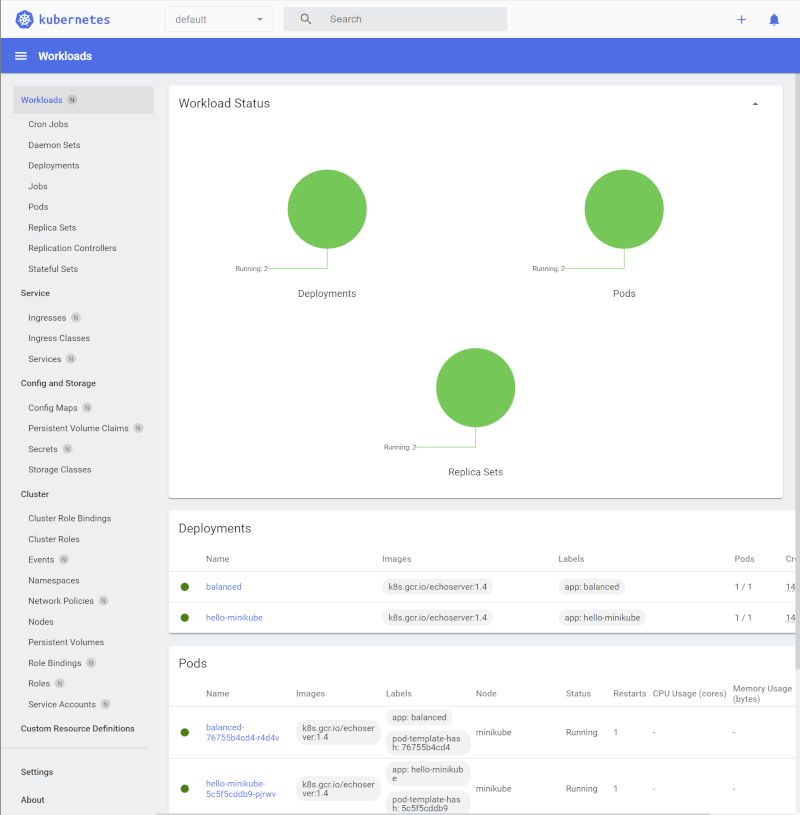

# Minikube Labs

According to the official page, [minikube][1] is local Kubernetes, focusing on making it easy to learn and develop for Kubernetes.

All you need is [Docker][2] (or similarly compatible) [container][3] or a [Virtual Machine][4] environment, and Kubernetes is a single command away: minikube start.

Per this lab, we'll use Docker, a few commands can be found [here][5]

It is meant to build one cluster, if you are into certifications, Kubernetes various options that can be found in the below link

[https://www.cncf.io/][6]

[CKA][7]

## Requirements

Container or virtual machine manager, such as: [Docker][2], [Hyperkit][9], [Hyper-V][10], [KVM][11], [Parallels][12], [Podman][13], [VirtualBox][14], or [VMware Fusion/Workstation][15]

## Installation

Installers can be found in this [link][16] from the official minikube page,

In case that you are using [chocolatey][17], you can execute the below command:

```
choco install minikube
```

## Start the cluster

From the terminal with administrator privileges, execute the below command, which will download [Kubernetes][18] with the current images, it will also create the docker container with 2 CPUs and 8GB of RAM:

```
minikube start
```

You should see a message like this at the end:

```powershell
🏄  Done! kubectl is now configured to use "minikube" 
    cluster and "default" namespace by default
```

If anything goes wrong, the container was not properly initialized, you might see an output telling that the PROVIDER is not running

```powershell
😄  minikube v1.26.1 on Microsoft Windows 11 Pro 10.0.22000 Build 22000
✨  Using the docker driver based on existing profile
💣  Exiting due to PROVIDER_DOCKER_NOT_RUNNING: "docker version --format -" 
    exit status 1: error during connect: This error may indicate that the 
    docker daemon is not running.: 
    Get "http://%2F%2F.%2Fpipe%2Fdocker_engine/v1.24/version": 
    open //./pipe/docker_engine: The system cannot find the file specified.
💡  Suggestion: Start the Docker service
📘  Documentation: https://minikube.sigs.k8s.io/docs/drivers/docker/
```

There is more help in this [link][19]

## Interacting with the cluster

In previous step the kubectl was installed and configured, from this point we can make use of the cluster:

```
kubectl get po -A
```

At any time we can list all the deployments with the below command:

```powershell
kubectl get deploy
```

## Dashboard

Minikube comes with a beautiful dashboard where we can see Workloads, Services, Config, Storage, Clusters, Definitions and Settings where we can configure a bunch of things

```powershell
minikube dashboard
```


# The Hello World

We can create a hello world sample with the below commands:

```powershell
kubectl create deployment hello-minikube --image=k8s.gcr.io/echoserver:1.4
kubectl expose deployment hello-minikube --type=NodePort --port=8080
```

We can check if the service started with the below command:

```powershell
kubectl get services hello-minikube
```

The easiest way to access this service is to let minikube launch a web browser for you:

```powershell
minikube service hello-minikube
```

Alternatively, use kubectl to forward the port:

```powershell
kubectl port-forward service/hello-minikube 7080:8080
```

We can delete a deployment with the **delete deploy**

```powershell
kubectl delete deploy hello-minikube
```

## LoadBalancer deployments

To access a LoadBalancer deployment, use the “minikube tunnel” command. Here is an example deployment:

```powershell
kubectl create deployment balanced --image=k8s.gcr.io/echoserver:1.4
```
  
```powershell
kubectl expose deployment balanced --type=LoadBalancer --port=8080
```

In another window, start the tunnel to create a routable IP for the ‘balanced’ deployment:

```powershell
minikube tunnel
```

To find the routable IP, run this command and examine the EXTERNAL-IP column:

```powershell
kubectl get services balanced
```

Your deployment is now available at <EXTERNAL-IP>:8080

## Manage the cluster

Pause Kubernetes without impacting deployed applications:

```powershell
minikube pause
```

Unpause a paused instance:

```powershell
minikube unpause
```

Halt the cluster:

```powershell
minikube stop
```

Increase the default memory limit (requires a restart):

```powershell
minikube config set memory 16384
```

Browse the catalog of easily installed Kubernetes services:

```powershell
minikube addons list
```

Create a second cluster running an older Kubernetes release:

```powershell
minikube start -p aged --kubernetes-version=v1.16.1
```

Delete all of the minikube clusters:

```powershell
minikube delete --all
```

  [1]: https://minikube.sigs.k8s.io/docs/start/
  [2]: https://minikube.sigs.k8s.io/docs/drivers/docker/
  [3]: https://www.docker.com/resources/what-container/
  [4]: https://www.vmware.com/topics/glossary/content/virtual-machine.html
  [5]: https://github.com/vladcuevas/Container-Labs/blob/main/README.md
  [6]: https://www.cncf.io/
  [7]: https://www.cncf.io/certification/cka/
  [8]: https://minikube.sigs.k8s.io/docs/drivers/docker/
  [9]: https://minikube.sigs.k8s.io/docs/drivers/hyperkit/
  [10]: https://minikube.sigs.k8s.io/docs/drivers/hyperv/
  [11]: https://minikube.sigs.k8s.io/docs/drivers/kvm2/
  [12]: https://minikube.sigs.k8s.io/docs/drivers/parallels/
  [13]: https://minikube.sigs.k8s.io/docs/drivers/podman/
  [14]: https://minikube.sigs.k8s.io/docs/drivers/virtualbox/
  [15]: https://minikube.sigs.k8s.io/docs/drivers/vmware/
  [16]: https://minikube.sigs.k8s.io/docs/start/
  [17]: https://chocolatey.org/
  [18]: https://www.google.com/url?sa=t&rct=j&q=&esrc=s&source=web&cd=&cad=rja&uact=8&ved=2ahUKEwj8rKKs3Nv5AhX4t4QIHRv9C-gQFnoECBQQAQ&url=https%3A%2F%2Fkubernetes.io%2F&usg=AOvVaw0xBs3cfCr_LiSaO9HgIBOM
  [19]: https://minikube.sigs.k8s.io/docs/drivers/
